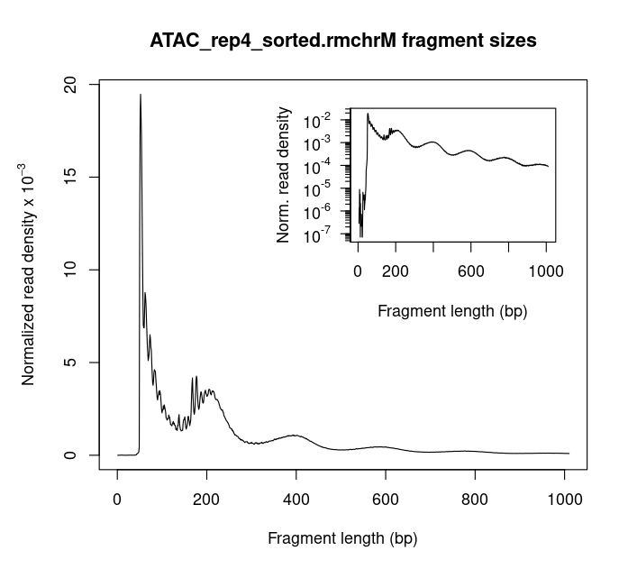

**Methods**

ATAC-seq samples, comprising two replicates sourced from a human origin, underwent a meticulous analysis pipeline to elucidate chromatin accessibility patterns. The workflow began with quality assessment and adapter trimming utilizing FastQC (v0.12.0) and Trimmomatic (v0.39), respectively, ensuring the integrity of subsequent analyses. Reads were aligned to the human reference genome (hg38) employing Bowtie2 (v2.5.3), leveraging the -X 2000 flag for optimal alignment efficiency. To maintain data fidelity, mitochondrial chromosome alignments were filtered out using SAMtools (v1.19.2). Addressing potential bias introduced during tagmentation, a read-shifting step was executed using the alignmentSieve function from deeptools (v3.5.6). Following read processing, fragment size distributions were evaluated with ATACSeqQC to assess data quality, facilitated by the `atacseqqc.R` script. Peak calling was performed independently for each replicate using MACS3 (v3.0.1), tailored with default parameters for ATAC-seq data analysis.

To generate a set of reproducible peaks, peaks identified from individual replicates were intersected using bedtools (v2.31.1). Furthermore, peaks overlapping with blacklisted regions were filtered out to enhance dataset reliability. Peak annotation was carried out using HOMER (v4.11) to associate peaks with nearby genomic features and genes. The proportion of peaks falling within distinct genomic regions, including promoters, intergenic regions, introns, exons, and transcription termination sites (TTS), was computed and visualized using custom scripts.

Motif analysis on reproducible peaks was conducted using MEME Suite (v5.5.5) to identify enriched sequence motifs associated with chromatin accessibility. Signal coverage plots, centered on the transcription start site (TSS), were generated for nucleosome-free regions (NFR) and nucleosome-bound regions (NBR) using PlotProfile. Additionally, nucleosome occupancy was assessed by calculating the proportions of reads aligning to NFR and NBR regions, visualized through bigWig files generated with deeptools.

In parallel, functional enrichment analysis was performed to elucidate biological processes associated with identified peaks. Gene Ontology (GO) enrichment analysis was conducted using HOMER (v4.11) to reveal biological pathways enriched among genes proximal to accessible chromatin regions. Furthermore, motif enrichment analysis was performed using MEME Suite (v5.5.5) to identify overrepresented DNA sequence motifs within accessible chromatin regions, providing insights into potential transcription factor binding sites underlying chromatin accessibility.

**Briefly remark on the quality of the sequencing reads and the alignment statistics, make sure to specifically mention the following:
    Are there any concerning aspects of the quality control of your sequencing reads?
    Are there any concerning aspects of the quality control related to alignment?
    Based on all of your quality control, will you exclude any samples from further analysis?**
    
    The box plots display consistently high-quality scores (above 32), indicative of accurate base calling and consistent quality across all bases. While replicate 1 shows uniformly high per tile sequence quality, replicate 2 exhibits minor horizontal lines, likely due to sequencing chemicals becoming exhausted towards the end of the run. Despite this, overall per sequence quality remains high, with the majority of sequences having mean scores above 30. Per base sequence quality remains consistent, with minor abnormalities in the first 15 base pairs attributed to inherent biases from transposase-based library fragmentation. GC content closely matches theoretical expectations, although a sharp peak suggests potential over-represented sequences. No N counts and a sharp peak in sequence length distribution affirm high sequencing quality. While sequence duplications are elevated, they may reflect specific gene over-expression in the analyzed subset. Adapter content (Nextera, indicative of ATAC-seq) remains low, below 5% at the end of reads, further supporting data quality.

    In conclusion, the quality control assessment of sequencing reads and alignment statistics indicates high-quality data suitable for downstream analysis. While minor concerns were observed in certain quality control metrics, they are not deemed significant enough to warrant exclusion of samples from further analysis.

**After alignment, quickly calculate how many alignments were generated from each sample in total and how many alignments were against the mitochondrial chromosome. Report the total number of alignments per sample. Report the number of alignments against the mitochondrial genome**

    +++++++++++++++++++++++++++++++++++++++++++++++++++++++++
    +  SAMPLES  +            ALIGNMENTS                     +
    +++++++++++++++++++++++++++++++++++++++++++++++++++++++++
    +           +   Total   + Mitochondrial + ChrM Filtered +    
    +++++++++++++++++++++++++++++++++++++++++++++++++++++++++
    + ATAC_rep3 + 163640696 +   121184688   +   41729416    +
    +++++++++++++++++++++++++++++++++++++++++++++++++++++++++
    + ATAC_rep4 + 120582179 +    88366285   +   31706950    +
    +++++++++++++++++++++++++++++++++++++++++++++++++++++++++

**Fragment Length Distribution Plot:**
    
  ATAC_rep3: 
    
    
  ATAC_rep4: 
    

**After performing peak calling analysis, generating a set of reproducible peaks and filtering peaks from blacklisted regions, please answer the following:
    How many peaks are present in each of the replicates? How many peaks are present in your set of reproducible peaks? What strategy did you use to determine “reproducible” peaks?**
    
    +++++++++++++++++++++++++++++++++++++++++
    +  SAMPLES          +      PEAKS        +    
    +++++++++++++++++++++++++++++++++++++++++
    + ATAC_rep3         +      47191        +
    +++++++++++++++++++++++++++++++++++++++++
    + ATAC_rep4         +      43114        +
    +++++++++++++++++++++++++++++++++++++++++
    + ATAC_intersect    +      31901        +
    +++++++++++++++++++++++++++++++++++++++++
    + ATAC_filtered     +      30974        +
    +++++++++++++++++++++++++++++++++++++++++
    
    I determined reproducible peaks by intersecting peak calls from two replicates using the `bedtools intersect` command. Peaks that overlapped between the two sets were considered reproducible, indicating consistency in peak calling.
    The intersected peak file post blacklist filtering is referred here as `ATAC_filtered.narrowPeak` and is placed under the results directory. 

**Signal Coverage Plot:**
    
  NFR regions:
  
  ATAC_rep3: 
          
      
  ATAC_rep4: 
          
    
  NBR regions:
        
  ATAC_rep3: 
          
        
  ATAC_rep4:  
          

**After performing motif analysis and gene enrichment on the peak annotations, please answer the following:
    Briefly discuss the main results of both of these analyses**
    
    Gene Enrichment:
        Based on the provided top 10 gene enrichment results, the main findings from this analysis appear to be:
        
        1. Significant enrichment of genes associated with intracellular components and organelles: The top hit is for the "intracellular part" GO term, indicating a strong enrichment of genes involved in various intracellular structures and components. Several other top hits are related to intracellular organelles, such as "cytoplasm," "nucleoplasm," "intracellular organelle," and "intracellular membrane-bounded organelle."
        
        2. Cytoplasmic localization of enriched genes: The third top hit is for the "cytoplasm" GO term, suggesting that many of the enriched genes are associated with cytoplasmic components or functions. The terms "cytoplasmic part" and "cell part" also appear in the top 10 hits, further supporting the cytoplasmic localization of the enriched genes.
        
        3. Potential involvement in KLF1 transcriptional targets: One of the top hits is the "PILON_KLF1_TARGETS_DN" gene set from the MSigDB collections. This gene set represents genes that are downregulated by the transcription factor KLF1, which is involved in erythroid development and regulation of various cellular processes.
        
        4. General cellular components and compartments: Broad terms like "cell part" and "cell" are also among the top hits, indicating that the enriched genes are associated with various cellular components and functions beyond specific organelles or compartments.
        
        Overall, the main results suggest a significant enrichment of genes involved in intracellular organelles, particularly those localized in the cytoplasm. Additionally, there appears to be an enrichment of genes potentially regulated by the KLF1 transcription factor, which could provide insights into the biological context or processes associated with the analyzed dataset.
    
  Gene Enrichment Results:
        
        For more detailed results: check out the `geneOntology.html` file in enrichment subdirectory inside results directory.

    Motif Analysis:
        Based on the provided top motif results, we can see a lot of transcription factors (TFs) and their binding motifs that are potentially enriched or relevant in the dataset or condition being studied.

        The identified TFs include:

        1. ONECUT1: A transcriptional activator important for liver gene transcription, binding to specific promoter sequences.
        2. ZNF384: A transcription factor regulating the promoters of genes involved in extracellular matrix remodeling, such as MMPs and COL1A1.
        3. THA11: A transcriptional repressor crucial for embryogenesis and maintaining the pluripotency of embryonic stem cells, recruiting epigenetic modifiers to target loci.
        4. ZN143: A transcriptional activator of the selenocysteine tRNA gene and involved in efficient U6 snRNA transcription by RNA polymerase III.
        5. ZN76: Potentially involved in transcriptional regulation, but its specific function is not well-defined.
        6. SP2, SP1, and SP3: Members of the Sp transcription factor family, which can act as activators or repressors, binding to GC-rich promoter elements and regulating various cellular processes.
        7. NFYA and NFYB: Components of the NF-Y transcription factor complex, recognizing the CCAAT box motif and regulating transcription of target genes, including core clock components like BMAL1.

        The identification of these TFs and their binding motifs suggests that the analyzed dataset or condition may be associated with transcriptional regulation of genes involved in various processes, such as:

        - Liver-specific gene expression (ONECUT1)
        - Extracellular matrix remodeling and tissue remodeling (ZNF384)
        - Embryonic development, stem cell pluripotency, and epigenetic regulation (THA11)
        - Selenoprotein biosynthesis and snRNA transcription (ZN143)
        - General transcriptional regulation and cellular processes (SP family, NF-Y complex)

        These results provide insights into the potential transcriptional regulatory mechanisms and pathways that may be active or dysregulated in the studied condition. Further investigations can be conducted to validate the roles of these TFs, their target genes, and the associated biological processes relevant to the analysis.

  Motif Analysis:
        
        For more detailed results, check out the `meme-chip.html` file in meme_out subdirectory inside results directory.

**What can chromatin accessibility let us infer biologically?**

        Chromatin accessibility analysis offers valuable insights into the potential regulatory mechanisms and biological processes associated with gene expression regulation. On a broad note, they help us in identifying the following: 

        1. Identification of Regulatory Regions: Open chromatin regions correspond to regulatory elements like promoters, enhancers, and insulators, influencing gene expression by binding transcription factors.

        2. Transcription Factor Binding Sites: Accessible chromatin harbors binding sites for transcription factors, revealing potential regulatory networks via motif analysis or integration with ChIP-seq data.

        3. Cell Type-Specific Regulation: Cell type-specific chromatin accessibility reflects unique gene expression programs and regulatory mechanisms, aiding in understanding cellular identity and biological processes.

        4. Developmental Dynamics: Changes in chromatin accessibility during development or differentiation provide insights into regulatory landscapes, facilitating the study of developmental trajectories and cell fate decisions.

        5. Disease-associated Changes: Alterations in chromatin accessibility are observed in diseases, offering insights into dysregulated gene expression and identifying potential therapeutic targets or biomarkers.

        6. Epigenetic Regulation: Chromatin accessibility is influenced by epigenetic mechanisms like DNA methylation and histone modifications, providing insights into gene regulation dynamics.

**Peak Annotations:**
    

    
